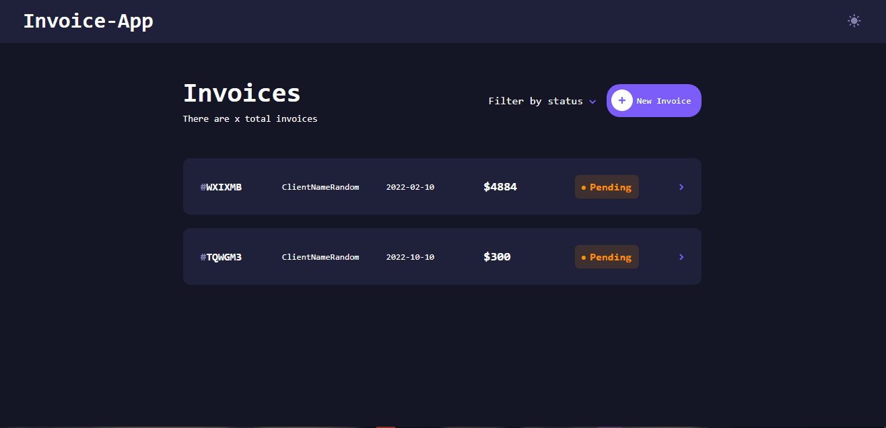

# Countries-app

## Demo 📸

 

## Application deploy with vercel: :dash:

> https://invoice-app-weld.vercel.app

Ps: There are a bug on create post only in deploy vercel. 
## 📜 About the Project

invoice-app is a project to organize your invoices.

### 📋 User Stories:

 - [x] - Create, read, update, and delete invoices.
 - [x] - Filter invoices by status (pending/paid).
 - [x] - See hover states for all interactive elements on the page.
 - [x] - View the optimal layout for the app depending on their device's screen size.
 - [x] - User can mark pending invoices as paid.
 - [x] - Receive form validations when trying to create/edit an invoice.
 - [x] - Keep track of any changes, even after refreshing the browser. (Full-Stack Application)
 - [x] - Toggle the color scheme between light and dark mode

### 🛠 Technologies

<li><a href="https://reactjs.org">React.js</a></li>
<li><a href="https://styled-components.com">Styled-components</a></li>
<li><a href="https://nextjs.org">Next.js</a></li>
<li><a href="https://github.com/axios/axios">Axios</a></li>
<li><a href="https://www.typescriptlang.org">TypeScript</a></li>
<li><a href="https://editorconfig.org">EditorConfig</a></li>

## 💻 How to run the application

#### Pre-requisites:
You must have the tools installed:  <a href="">Git</a>, <a href="">Node.js</a>.
Change .env.example credentials for your credentials and rename the file for .env

<pre>
# In the terminal, clone the project:
$ git clone https://github.com/Wesley-wsl/invoice-app.git

# Enter the project folder:
$ cd invoice-app

# Install dependencies:
$ yarn install
or
$ npm install

# Run the application:
$ yarn start
or
$ npm run start
</pre>

Okay, now you can access the application from the route:  <a href="https://localhost:3000/">https://localhost:3000/</a>
